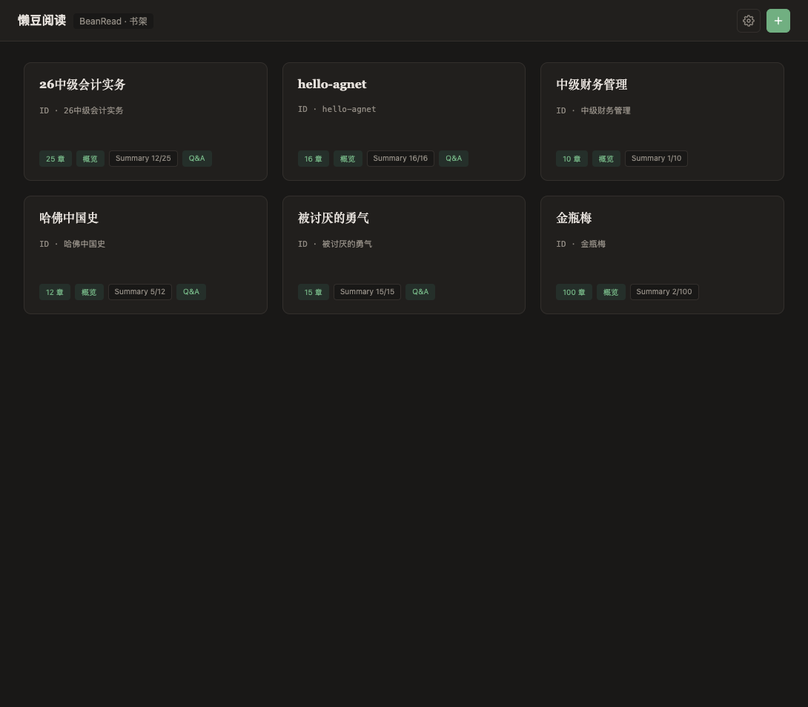
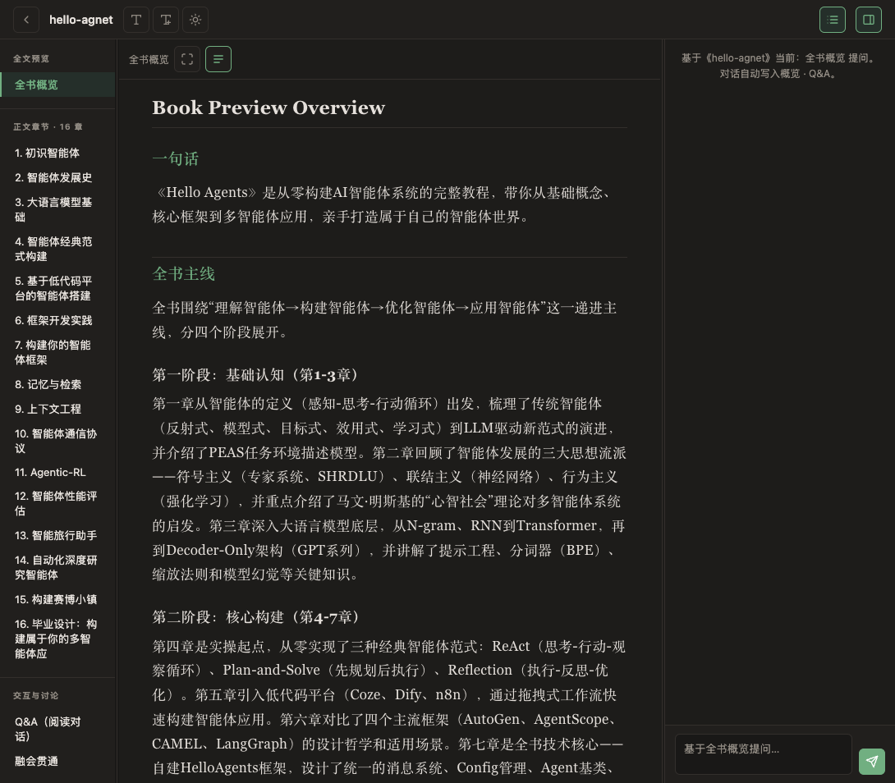
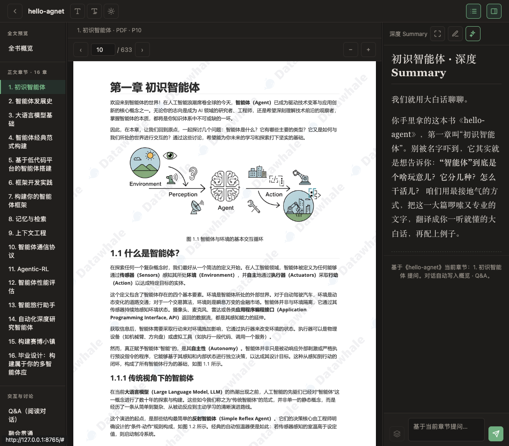

# 懒豆阅读 · BeanRead

**Sink in. Read on.** — 本地 AI 阅读助手：导入一本书，分章精读，生成深度 Summary，边读边问。

> 把 PDF / EPUB / TXT 变成可对话的知识库。数据留在本机，API Key 由你自己配置。

---

## 下载安装（v0.1.2）

| 平台 | 安装包 | 说明 |
|------|--------|------|
| **macOS** | [BeanRead-0.1.2-macOS.dmg](https://github.com/ZhuominLi/book-compiler/releases/download/v0.1.2/BeanRead-0.1.2-macOS.dmg) | 打开 DMG，拖入「应用程序」 |
| **Windows** | [BeanRead-0.1.2-Windows.zip](https://github.com/ZhuominLi/book-compiler/releases/download/v0.1.2/BeanRead-0.1.2-Windows.zip) | 解压后运行 `BeanRead\BeanRead.exe` |

[查看全部 Release →](https://github.com/ZhuominLi/book-compiler/releases/tag/v0.1.2)

### 首次打开

1. **macOS**：若提示「无法验证开发者」→ 右键 App → **打开**
2. **Windows**：若 SmartScreen 拦截 → **更多信息** → **仍要运行**
3. 点击右上角 **设置 ⚙** → **AI 接口**，填入你的 DeepSeek / OpenAI 兼容 API Key
4. 导入一本书，开始阅读

> 安装包**不会**携带开发者密钥。每人的 Key 与书库保存在本机用户目录。

| 平台 | 数据目录 |
|------|----------|
| macOS | `~/Library/Application Support/BeanRead/` |
| Windows | `%LOCALAPPDATA%\BeanRead\` |

### iPad / 手机

桌面版无法直接安装到 iPad。同一 WiFi 下可用 **Safari 访问 Mac 上正在运行的懒豆阅读**（启动后终端会显示局域网地址，如 `http://192.168.x.x:8765`）。

---

## 界面预览

### 书架 — 管理你的书库



按书丛分组，查看各书章节数、Summary 进度，一键进入阅读。

### 全书概览 — 读前先建立地图



AI 生成全书主线、章节地图与「是否值得深读」建议，右侧可直接针对概览提问。

### 章节精读 — 原文 + 深度 Summary + 对话



三栏布局：左目录、中 PDF/原文、右深度 Summary 与章节 Q&A。点击原文行号可跳转，支持跨章检索。

---

## 核心功能

- **多格式导入** — txt · md · docx · epub · pdf（文字层）
- **智能分章** — 自动识别「第 X 章 / 回 / 篇」
- **深度 Summary** — 流式生成，可自定义 Prompt 风格并保存预设
- **阅读对话** — 基于当前章节 / 全书概览提问，对话写入 Q&A 日志
- **跨章检索** — 可选开启，从全书其他章节检索相关 Summary 片段
- **热更新** — 设置内检查 runtime 更新（无需重装整包，macOS / Windows 桌面版）

---

## 开发 / 源码运行

适合贡献者或不想用安装包的用户：

```bash
git clone https://github.com/ZhuominLi/book-compiler.git
cd book-compiler

# Web UI（浏览器访问）
./run-ui.sh          # → http://127.0.0.1:8765

# CLI 管线
./run.sh all-pm
./run.sh deep --book inspired-cagan --chapter ch02
```

LLM 配置：项目根目录 `.env`（见 `.env.example`），或在 UI **设置 → AI 接口** 填写（优先）。

### 自行打包

```bash
# macOS → .app + .dmg
./scripts/build-macos.sh

# Windows → 在 GitHub Actions 构建，或本地 PowerShell：
# powershell -File scripts/build-windows.ps1
```

---

## 仓库结构

| 路径 | 说明 |
|------|------|
| `src/book_compiler/` | 拆书、Summary、PageIndex、LLM 管线 |
| `ui/static/` | 阅读器前端 |
| `launcher.py` | 桌面版入口（PyWebView + 本地服务） |
| `SPEC.md` | 数据格式与管线规范 |

---

## 许可证与说明

- 本项目为个人阅读工具，API 调用费用由使用者自行承担
- 规范与数据层设计详见 [SPEC.md](SPEC.md)

**懒一点，读进去。**
